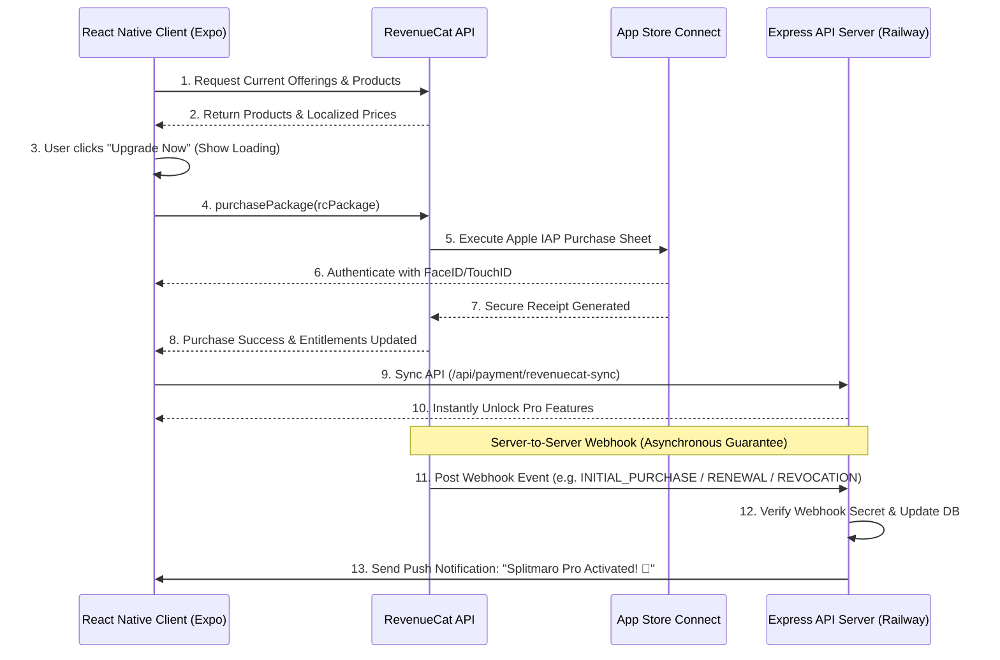

# 💎 Production-Grade RevenueCat & Apple Pay Setup Guide

This guide is designed for full-stack developers looking to deploy **RevenueCat In-App Purchases (IAP)** to production. It covers App Store Connect setup, client-side configuration in React Native/Expo, secure backend integrations via Webhooks, and deployment workflows using EAS Build and Railway.

---

## 🏗️ Architecture & Data Flow

To ensure high reliability, payment statuses are synchronized using both **client-side receipt verification** (instant feedback) and **server-side webhooks** (guaranteed delivery).



---

## 📦 Phase 1: App Store Connect & Apple Developer Portal Setup

Before writing code, your Apple developer account must be configured. If these steps are missed, Apple's servers will block your purchases.

### 1. Paid Applications Agreement (Mandatory)

Apple restricts In-App Purchases unless the Paid Applications Agreement is active.

1. Log in to [App Store Connect](https://appstoreconnect.apple.com/).
2. Select **Agreements, Tax, and Banking**.
3. Under **Agreements**, locate the **Paid Applications** agreement.
4. Click **Set Up** / **Accept**, fill in your contact information, bank account details, and tax forms.
5. Wait for the status to turn to **Active**.

### 2. Enable In-App Purchases in the App Identifier

1. Go to the [Apple Developer Certificates, Identifiers & Profiles Portal](https://developer.apple.com/account/resources/identifiers/list).
2. Click on your Identifier: `com.dineshruhela.vibhag`.
3. Under **Capabilities**, verify that **In-App Purchase** is checked.
4. Click **Save**.

### 3. Create the Product in App Store Connect

1. Go to **App Store Connect ➜ Apps ➜ Splitmaro (or Vibhag)**.

2. In the left-hand menu, under **Features**, select **In-App Purchases**.

3. Click the **+** button:

   - **Type:** Select **Non-Consumable** (recommended for a lifetime Pro upgrade).
   - **Reference Name:** `Splitmaro Pro Upgrade`
   - **Product ID:** `com.dineshruhela.vibhag.pro` *(Keep this unique ID safe; it must match your RevenueCat dashboard)*.

4. Fill in the required metadata:

   - **Pricing:** Select your target price (e.g., Tier 5 / ₹499).

   - **App Store Information:**

     - **Display Name:** `Splitmaro Pro`
     - **Description:** `Unlock unlimited groups, recurring expenses, budget alerts, and PDF exports.`

   - **Review Information:** Upload a screenshot of your app's upgrade screen.

     > 💡 **Tip:** Use the Apple Store Connect screenshot generator or upload an image matching standard sizes (e.g., 1242 × 2688px or 1284 × 2778px).

5. Click **Save**. The status will change to **Ready to Submit**.

### 4. Generate App Store Connect API Credentials

RevenueCat needs these credentials to communicate with Apple's servers on your behalf to read app metadata and verify transaction statuses.

1. In App Store Connect, go to **Users and Access ➜ Integrations ➜ App Store Connect API**.

2. Click **+** (Generate API Key).

3. **Name:** `RevenueCat Integration Key`

4. **Access:** Choose **Admin** or **App Manager** (Admin is recommended by RevenueCat).

5. Click **Generate**.

6. Copy the **Issuer ID** (displayed at the top of the page).

7. Copy the **Key ID** (displayed in the row of your newly created key).

8. Click **Download API Key** (downloads a `.p8` file).

   > ⚠️ **Warning:** The private key `.p8` file can only be downloaded **once**. Back it up securely.

### 5. Generate the App-Specific Shared Secret

1. In App Store Connect, go to **Apps** and click on your app **Splitmaro** (or **Vibhag**).
2. On the left-hand sidebar, scroll down to the **General** section and click on **App Information**.
3. Scroll down the page to the bottom to find the **App-Specific Shared Secret** section.
4. Click **Manage** and generate a shared secret string. Copy this value for RevenueCat.

---

## 🌐 Phase 2: RevenueCat Dashboard Configuration

### 1. Register the iOS App

1. Log in to the [RevenueCat Dashboard](https://app.revenuecat.com/).
2. Select your Project, then click **Project Settings ➜ Apps ➜ Add App**.
3. Choose **App Store**.
4. Fill in the details:
   - **App Name:** `Splitmaro iOS`
   - **App Store Bundle ID:** `com.dineshruhela.vibhag`
5. In the **App Store Connect API** section, enter:
   - **Issuer ID** (copied in Phase 1)
   - **Key ID** (copied in Phase 1)
   - **Private Key (.p8 file)** (upload the downloaded `.p8` file)
6. Under **Shared Secret**, paste the App-Specific Shared Secret.
7. Click **Save**.

### 2. Set Up Products, Entitlements & Offerings

1. **Products:** Go to **Product Catalog ➜ Products ➜ + New**.
   - **Store:** `App Store`
   - **Identifier:** `com.dineshruhela.vibhag.pro`
2. **Entitlements:** Go to **Product Catalog ➜ Entitlements ➜ + New**.
   - **Identifier:** `pro` (this is the key referenced in code to unlock features)
   - Attach the product `com.dineshruhela.vibhag.pro` to this entitlement.
3. **Offerings:** Go to **Product Catalog ➜ Offerings ➜ + New Offering**.
   - **Identifier:** `default`
   - Inside the offering, click **Add Package** ➜ Select **Lifetime** ➜ Add identifier (e.g. `$rc_lifetime`).
   - Attach the App Store Product `com.dineshruhela.vibhag.pro` to the package.
4. Click **Make Current** at the top right of the `default` offering page.

---

## 📱 Phase 3: Client-Side (React Native / Expo) Optimization

### 1. Environment Configurations (`eas.json`)

Manage development and production RevenueCat API keys separately. Modify your `eas.json` to store environment-specific variables:

```json
{
  "build": {
    "development": {
      "developmentClient": true,
      "distribution": "internal",
      "ios": {
        "simulator": true
      }
    },
    "preview": {
      "autoIncrement": true,
      "distribution": "internal",
      "env": {
        "EXPO_PUBLIC_API_URL": "https://api.dineshruhela.com",
        "EXPO_PUBLIC_REVENUECAT_IOS_API_KEY": "appl_kFuVZFvDgJaSAYUYHtFbpsYpKXA"
      }
    },
    "production": {
      "autoIncrement": true,
      "env": {
        "EXPO_PUBLIC_API_URL": "https://api.dineshruhela.com",
        "EXPO_PUBLIC_REVENUECAT_IOS_API_KEY": "appl_production_api_key_here"
      }
    }
  }
}
```

---

### 2. Production-Ready Upgrade Screen Layout (`app/pro/upgrade.tsx`)

This optimized implementation includes:

- **ActivityIndicator (Spinner)** for loading states.
- **Restore Purchases button** (Required by Apple Review Guidelines to prevent rejection).
- **Graceful handling of cancel actions** (ignores throwing errors on user cancellations).

Add the following optimized logic to your `upgrade.tsx`:

```tsx
import React, { useState, useEffect } from 'react';
import { 
  Alert, 
  DeviceEventEmitter, 
  Pressable, 
  ScrollView, 
  StyleSheet, 
  Text, 
  View, 
  Platform, 
  ActivityIndicator 
} from 'react-native';
import { useRouter } from 'expo-router';
import { Ionicons } from '@expo/vector-icons';
import { SafeAreaView } from 'react-native-safe-area-context';
import Animated, { FadeInDown, FadeInUp } from 'react-native-reanimated';
import { useThemeColors } from '@/hooks/useThemeColor';
import { BorderRadius, Spacing } from '@/constants/Spacing';
import { refreshCurrentUser } from '../../lib/database';

export default function UpgradeScreen() {
  const colors = useThemeColors();
  const router = useRouter();
  const [price, setPrice] = useState(499);
  const [currencySymbol, setCurrencySymbol] = useState('₹');
  const [loading, setLoading] = useState(false);
  const [rcPackage, setRcPackage] = useState<any>(null);

  useEffect(() => {
    if (Platform.OS === 'ios') {
      (async () => {
        try {
          const Purchases = require('react-native-purchases').default;
          const offerings = await Purchases.getOfferings();
          if (offerings.current !== null && offerings.current.availablePackages.length !== 0) {
            const proPackage = offerings.current.availablePackages[0];
            setRcPackage(proPackage);
            setPrice(proPackage.product.price);
            setCurrencySymbol(proPackage.product.currencySymbol || '₹');
          }
        } catch (e) {
          console.warn('[UpgradeScreen] Failed to fetch offerings:', e);
        }
      })();
    }
  }, []);

  const checkEntitlements = async (customerInfo: any) => {
    // Check if the "pro" entitlement is active
    const isEntitled = 
      typeof customerInfo.entitlements.active['pro'] !== 'undefined' || 
      typeof customerInfo.entitlements.active['splitmaro Pro'] !== 'undefined' ||
      Object.keys(customerInfo.entitlements.active).length > 0;

    if (isEntitled) {
      console.log('[UpgradeScreen] Entitlement verified! Syncing with backend...');
      const { syncRevenueCatProStatus } = require('../../lib/database');
      await syncRevenueCatProStatus({
        amount: rcPackage?.product?.price || price,
        currency: rcPackage?.product?.currencyCode || 'INR',
      });
      
      DeviceEventEmitter.emit('auth_change');
      Alert.alert('Welcome to Pro! 💎', 'Splitmaro Pro features have been successfully unlocked on your account.', [
        { text: 'Awesome!', onPress: () => router.back() }
      ]);
    } else {
      Alert.alert('No Subscription Found', 'We could not verify an active Pro entitlement. Please try buying or restoring again.');
    }
  };

  const handleUpgrade = async () => {
    if (loading) return;
    setLoading(true);
    try {
      if (Platform.OS === 'ios') {
        const Purchases = require('react-native-purchases').default;
        if (!rcPackage) {
          throw new Error('Offerings are still loading. Please wait a second.');
        }

        console.log('[UpgradeScreen] Launching Purchase Flow for:', rcPackage.identifier);
        const { customerInfo } = await Purchases.purchasePackage(rcPackage);
        await checkEntitlements(customerInfo);
      }
    } catch (e: any) {
      // Check if user cancelled the purchase (common event, shouldn't show scary error pop-ups)
      if (e.userCancelled) {
        console.log('[UpgradeScreen] User cancelled Apple checkout sheet.');
      } else {
        console.error('[UpgradeScreen] Purchase error:', e);
        Alert.alert('Payment Failed', e.message || 'Unable to complete transaction. Please try again.');
      }
    } finally {
      setLoading(false);
    }
  };

  const handleRestorePurchases = async () => {
    if (loading) return;
    setLoading(true);
    try {
      if (Platform.OS === 'ios') {
        const Purchases = require('react-native-purchases').default;
        console.log('[UpgradeScreen] Triggering Restore Purchases...');
        const customerInfo = await Purchases.restorePurchases();
        await checkEntitlements(customerInfo);
      }
    } catch (e: any) {
      console.error('[UpgradeScreen] Restore error:', e);
      Alert.alert('Restore Failed', e.message || 'Unable to restore transactions.');
    } finally {
      setLoading(false);
    }
  };

  return (
    <SafeAreaView style={[styles.root, { backgroundColor: colors.background }]}>
      <View style={styles.header}>
        <Pressable onPress={() => router.back()} style={styles.closeBtn}>
          <Ionicons name="close" size={24} color={colors.text} />
        </Pressable>
        {/* Restore Purchases Button (Mandatory for App Store Compliance) */}
        <Pressable onPress={handleRestorePurchases} disabled={loading} style={styles.restoreBtn}>
          <Text style={[styles.restoreText, { color: colors.primary }]}>Restore</Text>
        </Pressable>
      </View>

      <ScrollView contentContainerStyle={styles.scroll} showsVerticalScrollIndicator={false}>
        <Animated.View entering={FadeInUp.delay(100).springify()} style={styles.hero}>
          <View style={[styles.diamondIcon, { backgroundColor: colors.primary }]}>
            <Ionicons name="diamond-outline" size={40} color="#FFF" />
          </View>
          <Text style={[styles.title, { color: colors.text }]}>Splitmaro Pro</Text>
          <Text style={[styles.subtitle, { color: colors.textSecondary }]}>
            Level up your expense sharing with premium analytical capabilities.
          </Text>
        </Animated.View>

        {/* List of Features */}
        <View style={styles.featuresList}>
          {[
            { icon: 'people', title: 'Unlimited Groups', desc: 'Manage unlimited group expenses easily.' },
            { icon: 'repeat', title: 'Recurring Bills', desc: 'Auto-generate monthly rent, Wi-Fi or streaming bills.' },
            { icon: 'document-text', title: 'Detailed CSV Export', desc: 'Export group ledgers directly into spreadsheets.' }
          ].map((f, i) => (
            <Animated.View 
              key={i} 
              entering={FadeInDown.delay(200 + i * 100).springify()} 
              style={[styles.featureCard, { backgroundColor: colors.surface, borderColor: colors.border }]}
            >
              <View style={[styles.featureIcon, { backgroundColor: colors.primary + '15' }]}>
                <Ionicons name={f.icon as any} size={22} color={colors.primary} />
              </View>
              <View style={styles.featureText}>
                <Text style={[styles.featureTitle, { color: colors.text }]}>{f.title}</Text>
                <Text style={[styles.featureDesc, { color: colors.textTertiary }]}>{f.desc}</Text>
              </View>
            </Animated.View>
          ))}
        </View>

        <View style={{ height: 40 }} />

        <Animated.View entering={FadeInDown.delay(600).springify()}>
          <Pressable 
            onPress={handleUpgrade} 
            disabled={loading}
            style={[styles.upgradeBtn, { backgroundColor: colors.primary, opacity: loading ? 0.7 : 1 }]}
          >
            {loading ? (
              <ActivityIndicator color="#FFF" size="small" />
            ) : (
              <Text style={styles.btnText}>
                {`Upgrade Now — ${currencySymbol}${price}`}
              </Text>
            )}
          </Pressable>
        </Animated.View>
      </ScrollView>

      <View style={[styles.footer, { borderTopColor: colors.borderLight }]}>
        <View style={styles.priceContainer}>
          <Text style={[styles.priceLabel, { color: colors.textTertiary }]}>ONE-TIME UPGRADE</Text>
          <Text style={[styles.price, { color: colors.text }]}>{`${currencySymbol}${price}`}</Text>
        </View>
      </View>
    </SafeAreaView>
  );
}

const styles = StyleSheet.create({
  root: { flex: 1 },
  header: { 
    flexDirection: 'row', 
    justifyContent: 'space-between', 
    alignItems: 'center', 
    paddingHorizontal: Spacing.base, 
    paddingVertical: Spacing.sm 
  },
  closeBtn: { width: 40, height: 40, alignItems: 'center', justifyContent: 'center' },
  restoreBtn: { paddingHorizontal: 12, paddingVertical: 8 },
  restoreText: { fontSize: 14, fontWeight: '600' },
  scroll: { padding: Spacing.xl },
  hero: { alignItems: 'center', marginBottom: 40 },
  diamondIcon: { 
    width: 80, 
    height: 80, 
    borderRadius: 24, 
    alignItems: 'center', 
    justifyContent: 'center', 
    marginBottom: Spacing.lg, 
    transform: [{ rotate: '45deg' }] 
  },
  title: { fontSize: 32, fontWeight: '800', marginBottom: 12 },
  subtitle: { fontSize: 16, textAlign: 'center', lineHeight: 22, paddingHorizontal: 20 },
  featuresList: { gap: 16 },
  featureCard: { flexDirection: 'row', padding: 16, borderRadius: BorderRadius.lg, borderWidth: 1, gap: 16, alignItems: 'center' },
  featureIcon: { width: 44, height: 44, borderRadius: 12, alignItems: 'center', justifyContent: 'center' },
  featureText: { flex: 1 },
  featureTitle: { fontSize: 16, fontWeight: '700', marginBottom: 2 },
  featureDesc: { fontSize: 13, lineHeight: 18 },
  upgradeBtn: {
    padding: Spacing.lg,
    borderRadius: BorderRadius.xl,
    alignItems: 'center',
    marginHorizontal: Spacing.base,
    justifyContent: 'center',
    minHeight: 52,
  },
  btnText: { color: '#FFF', fontSize: 16, fontWeight: '700' },
  footer: { padding: Spacing.xl, flexDirection: 'row', alignItems: 'center', gap: 20, borderTopWidth: 1 },
  priceContainer: { flex: 1 },
  priceLabel: { fontSize: 10, fontWeight: '700', letterSpacing: 1 },
  price: { fontSize: 24, fontWeight: '800' },
});
```

---

## 🖥️ Phase 4: Express API Backend & Webhook Integration

Relying purely on the client application to make the API sync request (`/api/payment/revenuecat-sync`) is unsafe for production builds. If the user's connection drops or the app crashes right after paying on Apple, the database won't sync and they will be charged without receiving Pro access.

To prevent this, you **must** configure a **RevenueCat Webhook** that will send events directly to your server.

### 1. Create Webhook Route (`splitmaro-api/index.ts`)

Add a secure Express route to parse RevenueCat webhooks, process events, and verify authorizations:

```typescript
import { Request, Response } from 'express';
import { v4 as uuidv4 } from 'uuid';

/**
 * POST /api/payment/revenuecat-webhook
 * Webhook listener for real-time lifecycle synchronization from RevenueCat
 */
app.post('/api/payment/revenuecat-webhook', async (req: Request, res: Response) => {
  try {
    // 1. Verify Webhook Authenticity (RevenueCat Shared Authorization Secret)
    const authHeader = req.headers.authorization;
    const expectedSecret = process.env.REVENUECAT_WEBHOOK_SECRET;

    if (!expectedSecret || authHeader !== `Bearer ${expectedSecret}`) {
      console.warn('[RevenueCat Webhook] Rejected unauthorized webhook call.');
      return res.status(401).json({ error: 'Unauthorized webhook request' });
    }

    const { event } = req.body;
    if (!event) {
      return res.status(400).json({ error: 'Missing event payload' });
    }

    const userId = event.app_user_id;
    const eventType = event.type;

    console.log(`[RevenueCat Webhook] Received ${eventType} event for user ${userId}`);

    // Validate that the user exists in our database
    const user = await prisma.user.findUnique({ where: { id: userId } });
    if (!user) {
      console.warn(`[RevenueCat Webhook] User ${userId} not found in database. Skipping.`);
      return res.status(200).json({ received: true, warning: 'User not found' });
    }

    // 2. Handle Event Types
    switch (eventType) {
      case 'INITIAL_PURCHASE':
      case 'RENEWAL':
      case 'NON_RENEWING_PURCHASE': {
        // Activate Pro Status
        await prisma.user.update({
          where: { id: userId },
          data: { 
            is_pro: 1, 
            updated_at: BigInt(Date.now()) 
          }
        });

        // Register transaction in purchases table if not already present
        const transactionId = event.transaction_id || `rc_webhook_${Date.now()}`;
        const existingPurchase = await prisma.purchase.findFirst({
          where: { provider: 'revenuecat_apple_iap', razorpay_payment_id: transactionId }
        });

        if (!existingPurchase) {
          await prisma.purchase.create({
            data: {
              id: uuidv4(),
              user_id: userId,
              amount: event.price_in_purchased_currency || 499.00,
              currency: event.purchased_currency || 'INR',
              status: 'completed',
              provider: 'revenuecat_apple_iap',
              razorpay_payment_id: transactionId,
              created_at: BigInt(Date.now())
            }
          });
        }

        // Send Push Notification
        try {
          await sendPushNotification(userId, 'Splitmaro Pro Activated! 💎', 'Thank you for upgrading. Enjoy all premium benefits!');
        } catch (pushErr) {
          console.error('Failed to dispatch upgrade push notification:', pushErr);
        }
        break;
      }

      case 'EXPIRATION':
      case 'REVOCATION': {
        // Revoke Pro status on expiration/refunds
        await prisma.user.update({
          where: { id: userId },
          data: { 
            is_pro: 0, 
            updated_at: BigInt(Date.now()) 
          }
        });

        try {
          await sendPushNotification(userId, 'Subscription Expired 💎', 'Your Splitmaro Pro benefits have expired. Tap to renew.');
        } catch (pushErr) {
          console.error('Failed to dispatch expiration push notification:', pushErr);
        }
        break;
      }

      default:
        console.log(`[RevenueCat Webhook] Ignored unhandled event type: ${eventType}`);
    }

    return res.status(200).json({ received: true });
  } catch (error: any) {
    console.error('[RevenueCat Webhook Error]:', error);
    return res.status(500).json({ error: 'Internal Server Error' });
  }
});
```

### 2. Configure Backend Webhook Secret

1. Add a secure, random API Key to your `.env` file on your server (e.g. `REVENUECAT_WEBHOOK_SECRET=SplitMaroRcSec2026!`).
2. Go to **RevenueCat Dashboard ➜ Project Settings ➜ Integrations ➜ Webhooks ➜ Add New**.
3. **URL:** `https://your-api-domain.com/api/payment/revenuecat-webhook` (Use your production API URL).
4. **Authorization Header:** Set custom header to: `Bearer SplitMaroRcSec2026!` (matches your environment variable).
5. Under **Selected Events**, check `Initial Purchase`, `Renewal`, `Expiration`, and `Billing Issue`.
6. Click **Save**.

---

## 🚀 Phase 5: EAS Build & Production Deployment Workflow

Since you do not have prior deployment experience, here is a detailed, CLI-driven guide to compiling your production application binaries for iOS.

### 1. Install EAS CLI and Authenticate

Open terminal inside `/Users/dineshruhela/Work/vibhag` and run:

```bash
# 1. Install Expo Application Services CLI globally
npm install -g eas-cli

# 2. Log into your Expo account
eas login
```

### 2. Check Configuration

Initialize your project configurations if not done:

```bash
eas project:init
```

This ensures your project ID in `app.json` (`a3a4d9c4-4ad7-4258-aee1-6e2f1eefdb44`) matches your Expo cloud dashboard.

### 3. Store Environment Credentials Securely (EAS Secrets)

Production builds compile on Expo’s remote builders. Because files like `.env` are ignored by git, you must store your keys as **EAS Secrets** so they inject securely during compilation.

Run the following commands in your terminal:

```bash
eas secret:create --name EXPO_PUBLIC_API_URL --value "https://api.dineshruhela.com"
eas secret:create --name EXPO_PUBLIC_REVENUECAT_IOS_API_KEY --value "appl_production_api_key_here"
```

### 4. Build the Production IPA

Run the iOS build command. EAS will handle the certificates, build provisioning, and output a distribution-ready `.ipa` file.

```bash
eas build --platform ios --profile production
```

> ❓ **What happens next?**
>
> 1. EAS will ask if you want to log into your Apple Developer Portal. Select **Yes** and input your credentials.
> 2. EAS will automatically generate:
>    - Provisioning Profiles
>    - Production Certificates
>    - App Store Bundle Register IDs
> 3. Once finished, EAS returns a URL to download your binary and updates your Expo dashboard.

### 5. Submit Build to TestFlight

To send your binary directly to Apple’s test track:

```bash
eas submit --platform ios --profile production
```

Or, configure Expo to build and submit in a single line:

```bash
eas build --platform ios --profile production --auto-submit
```

---

## 🛠️ Phase 6: App Store Submission & TestFlight Verification

### 1. Internal Sandbox Testing via TestFlight

Before you send the app to App Store review, verify payments work end-to-end:

1. Log in to [App Store Connect](https://appstoreconnect.apple.com/).
2. Select **Users and Access ➜ Sandbox ➜ Sandbox Testers**.
3. Create a test email/user (e.g. `tester-dinesh@mytest.com`).
4. On your test iPhone, open **Settings ➜ App Store ➜ Sandbox Account** and log in with this account.
5. Launch your app via **TestFlight**, tap **Upgrade Now**, and make sure it displays the sandbox loader and confirms successfully.
6. Verify on your backend dashboard (or DB) that the user `is_pro` was set to `1` and a webhook transaction record was created in the purchases table.

### 2. App Store Submission Guidelines Checklist

Apple reviews paywalls strictly. Make sure you meet these criteria to prevent rejection:

| Guideline | Requirement | Added in App? |
| --- | --- | --- |
| **Restore Button** | Must have a clear "Restore Purchases" button on the billing wall. | Yes ✅ |
| **Pricing Transparency** | Clearly show the price (e.g., "₹499 one-time"). | Yes ✅ |
| **Privacy Policy** | Include a clickable link to your app's privacy policy. | Yes ✅ |
| **Terms of Service** | Include a link to standard App Store terms (EULA). | Yes ✅ |
| **Paid Applications Status** | Agreement must show "Active" status in Agreements panel. | Yes ✅ |
